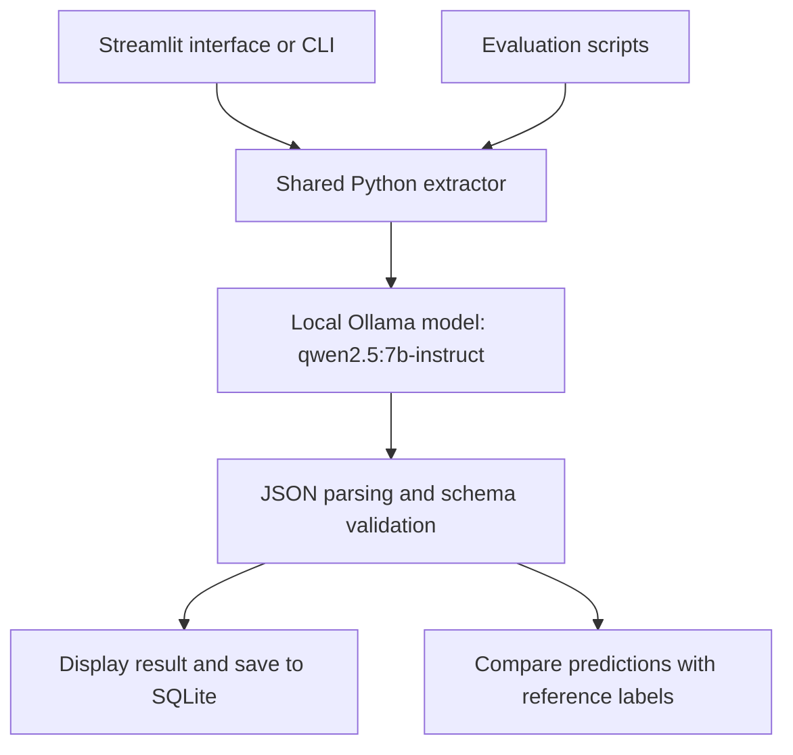

# Job-Description Structured Extractor

A local AI application that turns job adverts into structured records, with a focus on explicit UK visa-sponsorship information. Built with **Python, Ollama, Streamlit and SQLite**.

## The problem

Job adverts describe similar information in different ways. Skills, experience, working arrangements and sponsorship conditions may be scattered across long descriptions. Reviewing several roles means repeatedly finding the same details and keeping track of what each employer actually says.

This project brings those details into a consistent format. Its sponsorship fields distinguish between an explicit offer, a refusal or existing-right-to-work requirement, and no mention at all. A supporting quotation lets the user check the extraction against the original wording.

## What the application does

A user pastes a job description into the Streamlit interface. The application extracts its details, displays the structured result and saves the original text alongside the extraction in a local SQLite database. Previously saved results can be browsed in the same interface. An optional source note helps identify where a posting came from.

| Information | Extracted details |
| --- | --- |
| Role | Company, job title, seniority and years of experience |
| Skills | Required skills, optional preferred skills and technical tools |
| Working conditions | Employment type, location, remote policy and salary when available |
| Sponsorship | Explicit sponsorship signal, supporting quotation and visa-related phrases |

The application processes text supplied by the user. It does not scrape job boards, submit applications or determine immigration eligibility. A missing sponsorship statement means **“Not mentioned”**, not that sponsorship is unavailable.

## How it works



The extractor sends the posting to Qwen through Ollama with a JSON schema and a temperature of zero. The schema defines the fields, types and allowed categories; Python independently validates the returned JSON before passing it to the application. Valid structure does not guarantee a factually correct answer.

The UI, CLI and evaluation scripts share the same extraction function. This keeps model behaviour consistent across the application and its tests. Evaluation runs compare predictions with reference labels without adding records to the job-history database.

## Design decisions

- **Local inference:** job text is processed through the local Ollama service without a hosted model API key. Ollama must be running on the machine hosting the app.
- **Simple persistence:** SQLite stores the original text, extracted JSON and basic metadata in one file, suitable for a personal tool.
- **Duplicate-aware saving:** repeated text, after trimming outer whitespace, reuses the earliest saved record. A transaction protects the check and insert from competing saves through the application.
- **Recoverable failures:** the interface explains connection, missing-model, timeout and invalid-output errors. A successful extraction remains visible if saving fails.
- **Evidence-based changes:** prompt revisions follow observed extraction errors, with the original evaluation retained for comparison.

## Evaluation and findings

Recorded results from 23 September 2026:

| Evaluation | Result | What it measures |
| --- | --- | --- |
| Offline regression tests | 7/7 passed | Storage behaviour, validation, error handling and Streamlit interactions |
| Three synthetic postings | 12/12 field matches | Four categorical fields per posting |
| Five real postings, original prompt | 12/20 matches (60%) | Agreement with AI-assisted reference labels |
| Same five postings, revised prompt | 14/20 matches (70%) | Agreement after a targeted prompt clarification |

Real-posting testing exposed a repeated error: the model assumed **Full-time** when employment type was absent. It also inferred an onsite requirement from a city location. The prompt was clarified to use **Not specified** instead of making these assumptions. This corrected two predictions in one posting, while three unsupported Full-time predictions remained.

The real-posting labels were AI-assisted, not independently human-labelled. These same examples informed the prompt change, so the improvement is a tuning result—not an independent accuracy estimate. Scores cover seniority, employment type, remote policy and sponsorship signal; they do not measure every extracted field.

All five real texts omitted sponsorship wording. Further testing needs unseen adverts with explicit sponsorship offers and refusals. [Evaluation notes](docs/evaluation.md) explain the remaining ambiguities and reproducibility limits. Raw real adverts and local reports are excluded from this repository.

## Limitations and next steps

The model can produce structurally valid but unsupported claims. Seniority can be subjective, adverts can contradict themselves, and the current employment-type field cannot fully represent a role offering both full-time and part-time options. Extracted details should be checked against the original advert.

The next priority is evaluation on new, independently labelled postings before further tuning. The current app is intended for local, small-scale use: history is loaded in full, duplicate checks scan saved text, and running the Streamlit interface on another server also requires access to an Ollama service. Dependencies are currently unpinned.

## Run locally

Requires Python 3.12 and [Ollama](https://ollama.com) installed and running. From the project directory:

```bash
ollama pull qwen2.5:7b-instruct
python3.12 -m venv .venv
source .venv/bin/activate
python -m pip install -r requirements.txt
python -m streamlit run app.py
```

See the [setup and evaluation guide](docs/usage.md) for CLI usage, troubleshooting and labelling real postings.

```bash
python -m unittest discover -s tests -v
python eval/evaluate.py  # Requires Ollama and the model
```

## Repository structure

| File or folder | Purpose |
| --- | --- |
| `app.py` / `cli.py` | User interfaces |
| `extractor.py` | Shared prompt, model call, validation and extraction errors |
| `schema.py` | Structured output definition |
| `storage.py` | SQLite storage and duplicate handling |
| `sample_postings/` | Three synthetic examples |
| `eval/` | Synthetic and real-posting evaluation tools |
| `tests/` | Offline regression tests |
| `docs/` | Detailed usage instructions and evaluation notes |
